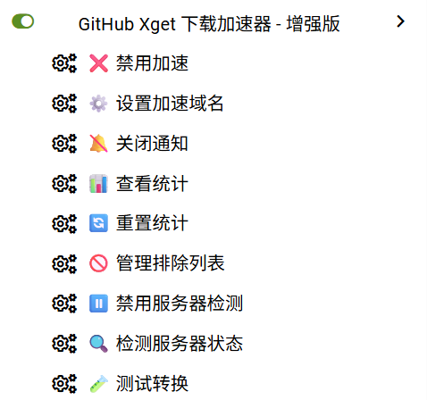

# ⚡ Xget 加速器增强版

<div align="center">


一个功能强大的油猴脚本，自动加速 GitHub、GitLab、Hugging Face 等开发者平台的文件下载

[安装脚本](#-安装方法) • [功能特性](#-功能特性) • [使用说明](#-使用说明) • [常见问题](#-常见问题)

</div>

---

## 📖 项目简介

本项目基于 [Xget](https://github.com/xixu-me/xget) 加速服务，通过油猴脚本自动将下载链接转换为加速链接，大幅提升国内访问 GitHub 等平台的下载速度。

### 增强版特性

✨ 相比原版，本增强版添加了以下功能：

- 🎯 **更精确的链接检测** - 针对不同平台的专属匹配规则
- 🛡️ **智能错误处理** - 自动检测服务器可用性，失败时降级到原始链接
- ⚡ **性能优化** - 节流防抖、事件委托，提升脚本运行效率
- 📊 **统计功能** - 记录加速次数、成功率等数据
- 🚫 **排除列表** - 支持自定义不需要加速的链接
- 🎨 **增强体验** - 精美的通知系统和交互动画

---

## 🌟 功能特性

### 支持的平台

| 平台 | 状态 | 说明 |
|------|------|------|
| GitHub | ✅ | Release、Archive、Raw 文件 |
| GitHub Gist | ✅ | Gist 文件下载 |
| GitLab | ✅ | Archive、附件下载 |
| Gitea | ✅ | Release、Archive |
| Codeberg | ✅ | 开源代码托管 |
| SourceForge | ✅ | 开源软件下载 |
| Hugging Face | ✅ | 模型文件下载 |
| Civitai | ✅ | AI 模型下载 |
| AOSP | ✅ | Android 源码 |

### 核心功能

- 🚀 **一键加速** - 自动拦截下载链接，无需手动操作
- ⚙️ **自定义域名** - 支持使用自己的加速服务器
- 📊 **下载统计** - 实时记录加速次数和成功率
- 🔔 **智能通知** - 可自定义显示/隐藏通知消息
- 🧪 **测试工具** - 内置 URL 转换测试功能
- 🎯 **精确匹配** - 使用正则表达式精确识别下载链接
- 🛡️ **健康检查** - 自动检测加速服务器可用性
- 🚫 **排除规则** - 灵活配置不需要加速的链接

---

## 🚀 安装方法

### 前置要求

1. 安装浏览器扩展（任选其一）：
   - [Tampermonkey](https://www.tampermonkey.net/) （推荐）
   - [Violentmonkey](https://violentmonkey.github.io/)
   - [Greasemonkey](https://www.greasespot.net/)

### 安装脚本

**方法一：直接安装**

点击下面的链接直接安装：

👉 [安装脚本](https://greasyfork.org/zh-CN/scripts/559674-github-xget-%E4%B8%8B%E8%BD%BD%E5%8A%A0%E9%80%9F%E5%99%A8-%E5%A2%9E%E5%BC%BA%E7%89%88)

**方法二：手动安装**

1. 复制 `xget_accelerator.js` 的内容
2. 打开 Tampermonkey 管理面板
3. 点击「添加新脚本」
4. 粘贴代码并保存

---

## 📝 使用说明

### 基本使用

1. 安装脚本后，访问支持的平台（如 GitHub）
2. 脚本会自动启用，右下角显示 `⚡ Xget 加速已启用` 指示器
3. 点击下载链接时，脚本会自动使用加速服务
4. 下载会在新标签页中打开

### 菜单功能

点击浏览器扩展图标 → Tampermonkey → Xget 加速器增强版，可以看到以下选项：

| 菜单项 | 功能说明 |
|--------|----------|
| ✅/❌ 启用/禁用加速 | 快速开关加速功能 |
| ⚙️ 设置加速域名 | 自定义加速服务器地址 |
| 🔔/🔕 通知开关 | 控制通知消息显示 |
| 📊 查看统计 | 查看详细的使用统计 |
| 🔄 重置统计 | 清空所有统计数据 |
| 🚫 管理排除列表 | 配置不需要加速的链接 |
| ▶️/⏸️ 服务器检测 | 开关自动可用性检测 |
| 🔍 检测服务器状态 | 手动检测服务器是否可用 |
| 🧪 测试转换 | 测试 URL 转换功能 |

### 高级功能

#### 1. 自定义加速域名

```
菜单 → ⚙️ 设置加速域名 → 输入域名 → 确定
```

域名格式：
- 默认：留空使用 `xget.xi-xu.me`
- 自定义：输入完整域名，如 `your-domain.com`
- 带端口：`your-domain.com:8080`

#### 2. 排除特定链接

```
菜单 → 🚫 管理排除列表 → 输入模式（每行一个）
```

支持的模式：
- 字符串匹配：`example.com`
- 正则表达式：`/test/`

---

## 🎨 截图展示

### 页面指示器



### 加速通知


### 统计信息


---

## ⚙️ 配置说明

### 默认配置

```javascript
CONFIG = {
    defaultDomain: 'xget.xi-xu.me',        // 默认加速域名
    enabled: true,                          // 是否启用加速
    customDomain: '',                       // 自定义域名（留空使用默认）
    showNotification: true,                 // 是否显示通知
    autoCheck: true,                        // 自动检测服务器可用性
    excludeList: []                         // 排除列表
}
```

### 数据存储

脚本使用 `GM_setValue` 存储配置，数据保存在浏览器本地，不会上传到任何服务器。

存储的数据：
- 用户配置（域名、开关等）
- 下载统计数据
- 服务器状态缓存

---

## ❓ 常见问题

### 1. 为什么有些链接没有被加速？

可能的原因：
- 链接不符合加速规则（不是下载链接）
- 链接在排除列表中
- 加速功能已关闭

**解决方法**：使用「🧪 测试转换」功能检查链接是否会被转换

### 2. 加速失败怎么办？

如果看到 `⚠️ 加速服务暂不可用` 提示：
1. 检查加速域名是否正确
2. 使用「🔍 检测服务器状态」手动检测
3. 尝试更换加速域名
4. 临时关闭自动检测（服务器不稳定时）

### 3. 如何使用自己的加速服务？

1. 按照 [Xget 项目](https://github.com/xixu-me/xget) 文档搭建服务
2. 在脚本中设置你的域名
3. 测试转换功能确保可用

### 4. 统计数据能清除吗？

可以，使用菜单中的「🔄 重置统计」功能。

### 5. 支持其他平台吗？

目前支持主流的开发者平台。如需添加新平台，欢迎提 Issue 或 PR。

---

## 🔧 开发说明

### 项目结构

```
xget-accelerator-enhanced/
├── xget_accelerator.js       # 主脚本文件
├── README.md                  # 说明文档
├── LICENSE                    # 开源协议
└── screenshots/               # 截图目录
    ├── indicator.png
    ├── notification.png
    └── stats.png
```

### 技术栈

- 原生 JavaScript（ES6+）
- Tampermonkey API
- DOM 操作和事件处理

### 贡献指南

欢迎提交 Issue 和 Pull Request！

提交 PR 前请确保：
- 代码风格一致
- 添加必要的注释
- 测试功能正常

---

## 📜 更新日志

### v3.0 (2025-12-21)

**新增功能：**
- ✨ 精确的链接检测系统
- 📊 完整的统计功能
- 🛡️ 服务器健康检查
- 🚫 排除列表支持
- ⚡ 性能优化（节流、防抖）

**改进：**
- 🎨 更美观的 UI 和动画
- 🔔 可自定义的通知系统
- 🎯 更准确的下载链接识别

**修复：**
- 🐛 修复部分链接误拦截问题
- 🔧 优化错误处理逻辑

---

## 🙏 致谢

- 感谢 [Xget](https://github.com/xixu-me/xget) 项目提供的加速服务
- 感谢所有贡献者和用户的支持

---

## 📄 许可证

本项目基于 [MIT License](LICENSE) 开源。

---

## 💬 联系方式

- 🎨 **作者**：毕加索自画像
- 🐛 **问题反馈**：[Issues](../../issues)
- 💡 **功能建议**：[Discussions](../../discussions)

---

<div align="center">

**如果这个项目对你有帮助，欢迎给个 ⭐ Star！**

Made with ❤️ by 毕加索自画像

</div>
